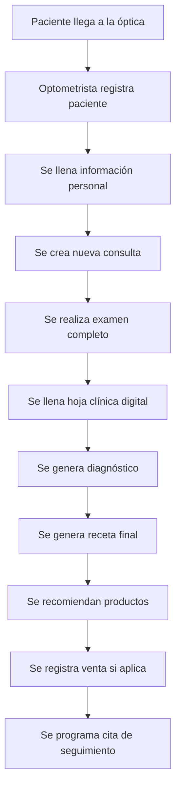
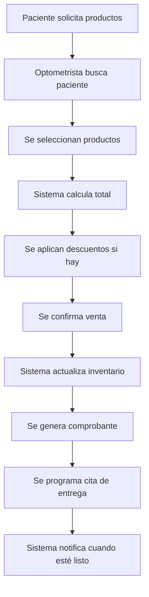
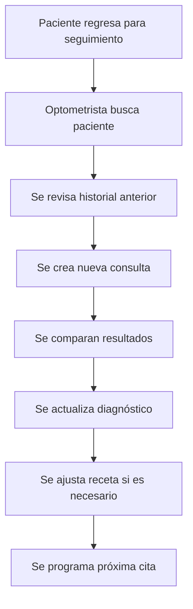
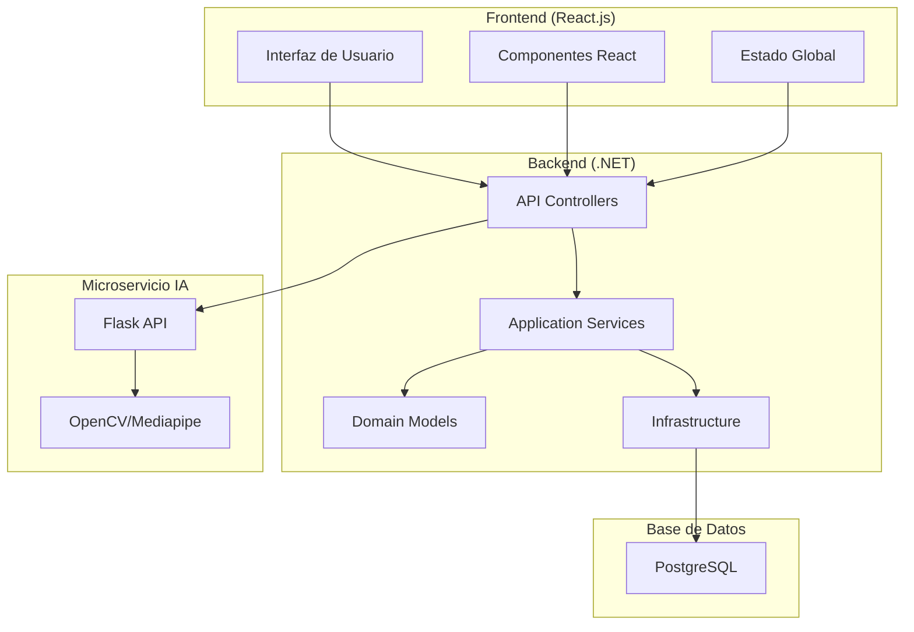
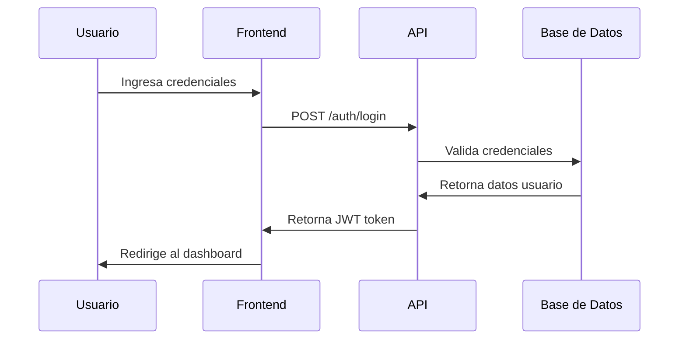
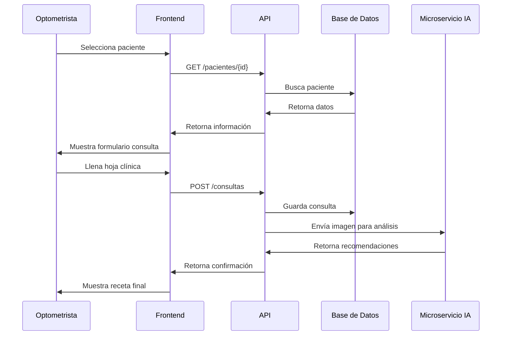

# 📋 Documentación de Requerimientos y Flujos - Sistema de Gestión de Óptica

> **Nota importante:**
> Este sistema está diseñado exclusivamente para uso del personal de la óptica (optometristas y administradores). Los pacientes no tienen acceso directo al sistema. Toda la información y recomendaciones generadas por el sistema son comunicadas al paciente por el personal autorizado.

## 📖 Índice
1. [Introducción](#introducción)
2. [Requerimientos Funcionales](#requerimientos-funcionales)
3. [Requerimientos No Funcionales](#requerimientos-no-funcionales)
4. [Alcance del Proyecto](#alcance-del-proyecto)
5. [Historias de Usuario](#historias-de-usuario)
6. [Flujos de Usuario](#flujos-de-usuario)
7. [Flujos de la Aplicación](#flujos-de-la-aplicación)
8. [Diagramas y Mockups](#diagramas-y-mockups)
9. [Criterios de Aceptación](#criterios-de-aceptación)

---

## 🎯 Introducción

Este documento define los requerimientos, flujos y alcance del Sistema de Gestión de Óptica "OpticaMaster", una aplicación web integral para la gestión administrativa y clínica de una óptica.

### Objetivo del Sistema
Automatizar y digitalizar todos los procesos de una óptica, desde la gestión de pacientes hasta la venta de productos ópticos, incluyendo la digitalización completa de la hoja clínica y la integración de inteligencia artificial para recomendaciones de armazones.

---

## 🔧 Requerimientos Funcionales

### RF-01: Gestión de Usuarios y Autenticación
- **RF-01.1**: El sistema debe permitir el registro y autenticación de usuarios (administradores y optometristas)
- **RF-01.2**: El sistema debe implementar autenticación JWT con roles diferenciados
- **RF-01.3**: El administrador debe poder gestionar usuarios del sistema
- **RF-01.4**: Los optometristas solo pueden gestionar sus propios registros

### RF-02: Gestión de Pacientes
- **RF-02.1**: El sistema debe permitir registrar nuevos pacientes con información completa
- **RF-02.2**: El sistema debe permitir buscar, editar y eliminar pacientes
- **RF-02.3**: El sistema debe mantener un historial completo de cada paciente
- **RF-02.4**: El sistema debe validar datos obligatorios del paciente
- **RF-02.5**: El sistema debe de enviar un mensaje de vienbenida al paciente despues de aver concluido su registro o despues de aver concluido todo el flujo como lo de la consulta, examen y demas...(obvio con el apartado de vienvenida tambien pondremos lo que se le hizo lo que compro)

### RF-03: Gestión de Consultas y Exámenes
- **RF-03.1**: El sistema debe permitir crear consultas asociadas a pacientes y optometristas
- **RF-03.2**: El sistema debe digitalizar la hoja clínica completa con todas sus secciones
- **RF-03.3**: El sistema debe permitir registrar diagnósticos y planes de tratamiento
- **RF-03.4**: El sistema debe generar recetas finales automáticamente

### RF-04: Gestión de Productos
- **RF-04.1**: El sistema debe permitir registrar productos ópticos (armazones, lentes, etc.)
- **RF-04.2**: El sistema debe mantener control de inventario
- **RF-04.3**: El sistema debe permitir categorizar productos por tipo
- **RF-04.4**: El sistema debe mostrar precios y disponibilidad

### RF-05: Gestión de Ventas
- **RF-05.1**: El sistema debe permitir registrar ventas de productos a pacientes
- **RF-05.2**: El sistema debe calcular totales automáticamente
- **RF-05.3**: El sistema debe actualizar inventario tras cada venta
- **RF-05.4**: El sistema debe generar comprobantes de venta

### RF-06: Gestión de Citas
- **RF-06.1**: El sistema debe permitir programar citas de seguimiento y entrega
- **RF-06.2**: El sistema debe validar disponibilidad de horarios
- **RF-06.3**: El sistema debe enviar notificaciones de citas "recordatorio o la fecha que se le programo." 
- **RF-06.4**: El sistema debe permitir cancelar y reprogramar citas

### RF-07: Sistema de Notificaciones
(Lo que se hace es que cuando llegan los productos el optometrista da aviso al sistema en un apartado, aun no se como llamarlo "notificaciones" o algo asi donde ingresara ya sea el nombre del paciente"ID" o el Nombre del producto"ID" para que asi primero le llame el optometrista y despues de llamarle el optometrista el sistema le mande un mensaje predefinido sobre su producto o de una cita o para entrega de su producto.)
- **RF-07.1**: El sistema debe notificar cuando productos estén listos para recoger
- **RF-07.2**: El sistema debe enviar recordatorios de citas
- **RF-07.3**: El sistema debe permitir búsqueda por producto o cliente para notificaciones

### RF-08: Reportes y Análisis
- **RF-08.1**: El sistema debe generar reportes de ventas mensuales
- **RF-08.2**: El sistema debe mostrar estadísticas de rendimiento por optometrista
- **RF-08.3**: El sistema debe generar reportes de inventario
- **RF-08.4**: El sistema debe permitir exportar reportes en diferentes formatos

### RF-09: Integración con IA
- **RF-09.1**: El sistema debe integrar reconocimiento facial para sugerencias de armazones
- **RF-09.2**: El sistema debe procesar imágenes de pacientes para análisis
- **RF-09.3**: El sistema debe proporcionar recomendaciones personalizadas

### RF-10: Auditoría y Logs
- **RF-10.1**: El sistema debe registrar todas las actividades de usuarios(optometrista)
- **RF-10.2**: El sistema debe permitir consultar logs de actividad
- **RF-10.3**: El sistema debe diferenciar acceso a logs por rol

---

## ⚡ Requerimientos No Funcionales

### RNF-01: Rendimiento
- **RNF-01.1**: El sistema debe responder en menos de 3 segundos para operaciones básicas
- **RNF-01.2**: El sistema debe soportar al menos 50 usuarios concurrentes
- **RNF-01.3**: El procesamiento de imágenes de IA debe completarse en menos de 10 segundos

### RNF-02: Seguridad
- **RNF-02.1**: El sistema debe implementar autenticación JWT segura
- **RNF-02.2**: El sistema debe encriptar contraseñas de usuarios
- **RNF-02.3**: El sistema debe validar todas las entradas de datos
- **RNF-02.4**: El sistema debe proteger contra ataques XSS y SQL Injection

### RNF-03: Disponibilidad
- **RNF-03.1**: El sistema debe estar disponible 99% del tiempo
- **RNF-03.2**: El sistema debe tener respaldos automáticos de la base de datos
- **RNF-03.3**: El sistema debe recuperarse de fallos en menos de 5 minutos

### RNF-04: Usabilidad
- **RNF-04.1**: La interfaz debe ser intuitiva y fácil de usar
- **RNF-04.2**: El sistema debe ser responsive (funcionar en diferentes dispositivos)
- **RNF-04.3**: El sistema debe tener navegación clara y consistente
- **RNF-04.4**: El sistema debe proporcionar feedback visual para todas las acciones

### RNF-05: Escalabilidad
- **RNF-05.1**: El sistema debe poder escalar horizontalmente
- **RNF-05.2**: La arquitectura debe permitir agregar nuevos módulos fácilmente
- **RNF-05.3**: El sistema debe soportar múltiples sucursales en el futuro

### RNF-06: Compatibilidad
- **RNF-06.1**: El sistema debe funcionar en navegadores modernos (Chrome, Firefox, Safari, Edge)
- **RNF-06.2**: El sistema debe ser compatible con dispositivos móviles
- **RNF-06.3**: El sistema debe funcionar en Windows, macOS y Linux

### RNF-07: Mantenibilidad
- **RNF-07.1**: El código debe seguir estándares de programación
- **RNF-07.2**: El sistema debe tener documentación completa
- **RNF-07.3**: El sistema debe permitir actualizaciones sin interrumpir el servicio

---

## 📊 Alcance del Proyecto

> **Aclaración:**
> El sistema es de uso interno. Todas las operaciones (registro, consultas, ventas, citas, recomendaciones de IA) son realizadas por el optometrista o el administrador. El paciente solo recibe información o recomendaciones a través del personal, nunca accede directamente al sistema.

### ✅ Lo que SÍ está incluido en el alcance:

#### Fase 1: Core del Sistema
- Sistema de autenticación y autorización
- Gestión completa de pacientes
- Digitalización de hoja clínica completa
- Gestión básica de productos e inventario
- Sistema de ventas básico
- Gestión de citas
- Reportes básicos

#### Fase 2: Funcionalidades Avanzadas
- Integración con microservicio de IA
- Reconocimiento facial para sugerencias
- Sistema de notificaciones
- Reportes avanzados y análisis
- Auditoría completa del sistema

#### Fase 3: Optimización
- Mejoras de rendimiento
- Optimización de la interfaz de usuario
- Pruebas exhaustivas
- Documentación de usuario final

### ❌ Lo que NO está incluido en el alcance:

#### Funcionalidades Futuras (Fase 4+)
- Integración con sistemas de pago (POS)
- Aplicación móvil nativa
- Integración con laboratorios externos
- Sistema de facturación electrónica
- Múltiples sucursales
- Integración con redes sociales
- Sistema de fidelización de clientes
- Integración con seguros médicos

#### Limitaciones Técnicas
- No incluye hardware específico (cámaras, escáneres)
- No incluye capacitación presencial del personal
- No incluye migración de datos existentes
- No incluye soporte técnico 24/7

---

## 👥 Historias de Usuario

### Epic 1: Gestión de Usuarios y Autenticación

#### HU-01: Inicio de Sesión
**Como** administrador u optometrista  
**Quiero** poder iniciar sesión en el sistema  
**Para** acceder a las funcionalidades según mi rol

**Criterios de Aceptación:**
- Debo poder ingresar mi usuario y contraseña
- El sistema debe validar mis credenciales
- Debo ser redirigido al dashboard correspondiente a mi rol
- Debo recibir un mensaje de error si las credenciales son incorrectas

#### HU-02: Gestión de Usuarios (Admin)
**Como** administrador  
**Quiero** poder gestionar usuarios del sistema  
**Para** dar de alta optometristas y administrar accesos, revision de estadisticas, podremos ver los historiales de cada optometrista como igual todo lo que sea administrativo lo podra haccer el admin pero no podra hacer cosas de optometrista.

**Criterios de Aceptación:**
- Debo poder crear nuevos usuarios optometristas
- Debo poder asignar contraseñas temporales
- Debo poder desactivar usuarios
- Debo poder ver todos los usuarios del sistema

### Epic 2: Gestión de Pacientes

#### HU-03: Registro de Paciente
**Como** optometrista  
**Quiero** poder registrar nuevos pacientes  
**Para** mantener un historial completo de cada persona

**Criterios de Aceptación:**
- Debo poder ingresar datos personales completos
- El sistema debe validar campos obligatorios
- Debo poder agregar información del tutor si es menor de edad
- El sistema debe generar un ID único para cada paciente

#### HU-04: Búsqueda de Pacientes
**Como** optometrista  
**Quiero** poder buscar pacientes existentes  
**Para** acceder rápidamente a su información

**Criterios de Aceptación:**
- Debo poder buscar por nombre, teléfono o email
- Debo ver una lista de resultados con información básica
- Debo poder acceder al historial completo del paciente
- La búsqueda debe ser en tiempo real

### Epic 3: Gestión de Consultas

#### HU-05: Crear Nueva Consulta
**Como** optometrista  
**Quiero** poder crear una nueva consulta  
**Para** registrar el examen completo de un paciente

**Criterios de Aceptación:**
- Debo poder seleccionar un paciente existente
- Debo poder llenar todas las secciones de la hoja clínica
- El sistema debe guardar automáticamente los cambios
- Debo poder generar una receta final

#### HU-06: Ver Historial de Consultas
**Como** optometrista  
**Quiero** poder ver el historial de consultas de un paciente  
**Para** hacer seguimiento de su evolución

**Criterios de Aceptación:**
- Debo ver todas las consultas ordenadas por fecha
- Debo poder acceder a los detalles de cada consulta
- Debo poder comparar resultados entre consultas
- Debo poder exportar el historial

### Epic 4: Gestión de Productos

#### HU-07: Registrar Producto
**Como** administrador  
**Quiero** poder registrar nuevos productos  
**Para** mantener un catálogo actualizado

**Criterios de Aceptación:**
- Debo poder ingresar nombre, tipo, descripción y precio
- Debo poder establecer el stock inicial
- Debo poder categorizar el producto
- El sistema debe generar un código único

#### HU-08: Gestionar Inventario
**Como** administrador  
**Quiero** poder gestionar el inventario de productos  
**Para** mantener control de stock

**Criterios de Aceptación:**
- Debo poder ver el stock actual de todos los productos
- Debo poder actualizar cantidades manualmente
- Debo recibir alertas de stock bajo
- Debo poder ver el historial de movimientos

### Epic 5: Gestión de Ventas

#### HU-09: Registrar Venta
**Como** optometrista  
**Quiero** poder registrar ventas de productos  
**Para** llevar control de las transacciones

**Criterios de Aceptación:**
- Debo poder seleccionar paciente y productos
- El sistema debe calcular el total automáticamente
- Debo poder aplicar descuentos si es necesario
- El sistema debe actualizar el inventario
- Debo poder generar un comprobante

#### HU-10: Ver Reporte de Ventas
**Como** administrador  
**Quiero** poder ver reportes de ventas  
**Para** analizar el rendimiento del negocio

**Criterios de Aceptación:**
- Debo poder filtrar por fechas
- Debo ver ventas totales y por producto
- Debo poder exportar los reportes
- Debo ver estadísticas de rendimiento

### Epic 6: Gestión de Citas

#### HU-11: Programar Cita
**Como** optometrista  
**Quiero** poder programar citas para pacientes  
**Para** organizar el calendario de consultas

**Criterios de Aceptación:**
- Debo poder seleccionar paciente y fecha/hora
- El sistema debe validar disponibilidad
- Debo poder establecer el tipo de cita
- Debo poder agregar notas adicionales

#### HU-12: Gestionar Calendario
**Como** optometrista  
**Quiero** poder ver y gestionar mi calendario de citas  
**Para** organizar mi agenda diaria

**Criterios de Aceptación:**
- Debo ver todas mis citas del día
- Debo poder cancelar o reprogramar citas
- Debo poder ver citas futuras
- Debo recibir recordatorios de citas

### Epic 7: Sistema de Notificaciones

#### HU-13: Notificar Producto Listo
**Como** administrador  
**Quiero** poder notificar cuando un producto esté listo  
**Para** informar al paciente que puede recogerlo

**Criterios de Aceptación:**
- Debo poder buscar por producto o cliente
- Debo poder enviar notificación por teléfono o email
- Debo poder registrar el envío de la notificación
- Debo poder ver el historial de notificaciones

### Epic 8: Integración con IA

#### HU-14: Análisis Facial
**Como** optometrista  
**Quiero** poder analizar la cara del paciente  
**Para** recibir sugerencias de armazones

**Criterios de Aceptación:**
- Debo poder subir una foto del paciente
- El sistema debe procesar la imagen con IA
- Debo recibir recomendaciones de armazones
- Debo poder guardar el análisis en el historial

---

## 🔄 Flujos de Usuario

### Flujo 1: Proceso de Registro y Primera Consulta



### Flujo 2: Proceso de Venta de Productos



### Flujo 3: Proceso de Seguimiento



---

## 🏗️ Flujos de la Aplicación

### Arquitectura del Sistema



### Flujo de Autenticación



### Flujo de Creación de Consulta



---

## 🎨 Diagramas y Mockups

### Mockup del Dashboard Principal

```
┌─────────────────────────────────────────────────────────────┐
│ OpticaMaster - Sistema de Gestión de Óptica                │
├─────────────────────────────────────────────────────────────┤
│ [Logo] [Menú] [Usuario: Dr. García] [Cerrar Sesión]        │
├─────────────────────────────────────────────────────────────┤
│                                                             │
│  ┌─────────────┐  ┌─────────────┐  ┌─────────────┐         │
│  │   Pacientes │  │  Consultas  │  │   Ventas    │         │
│  │      [150]  │  │     [45]    │  │    [23]     │         │
│  └─────────────┘  └─────────────┘  └─────────────┘         │
│                                                             │
│  ┌─────────────┐  ┌─────────────┐  ┌─────────────┐         │
│  │  Productos  │  │    Citas    │  │  Reportes   │         │
│  │     [89]    │  │     [12]    │  │   [Ver]     │         │
│  └─────────────┘  └─────────────┘  └─────────────┘         │
│                                                             │
│  ┌─────────────────────────────────────────────────────────┐ │
│  │                    Citas de Hoy                         │ │
│  │  09:00 - Juan Pérez (Consulta de seguimiento)          │ │
│  │  11:30 - María López (Entrega de lentes)               │ │
│  │  14:00 - Carlos Ruiz (Primera consulta)                │ │
│  └─────────────────────────────────────────────────────────┘ │
└─────────────────────────────────────────────────────────────┘
```

### Mockup de Registro de Paciente

```
┌─────────────────────────────────────────────────────────────┐
│ Registro de Nuevo Paciente                                  │
├─────────────────────────────────────────────────────────────┤
│                                                             │
│  Información Personal:                                      │
│  ┌─────────────────────────────────────────────────────────┐ │
│  │ Nombre: [________________________]                      │ │
│  │ Género: [Masculino ▼]  Edad: [__]                       │ │
│  │ Estado Civil: [Soltero ▼]                               │ │
│  │ Escolaridad: [Universidad ▼]                            │ │
│  │ Ocupación: [________________________]                   │ │
│  └─────────────────────────────────────────────────────────┘ │
│                                                             │
│  Información de Contacto:                                   │
│  ┌─────────────────────────────────────────────────────────┐ │
│  │ Domicilio: [________________________________________]   │ │
│  │ Email: [________________________]                       │ │
│  │ Teléfono: [________________]                            │ │
│  │ Tutor (si aplica): [________________________]          │ │
│  └─────────────────────────────────────────────────────────┘ │
│                                                             │
│  [Cancelar]                    [Guardar Paciente]          │
└─────────────────────────────────────────────────────────────┘
```

### Mockup de Hoja Clínica

```
┌─────────────────────────────────────────────────────────────┐
│ Hoja Clínica - Juan Pérez (ID: 001)                        │
├─────────────────────────────────────────────────────────────┤
│                                                             │
│  [Antecedentes] [Agudeza Visual] [Lensometría] [Refracción] │
│  [Alineación] [Motilidad] [Exploración] [Diagnóstico]       │
│                                                             │
│  ┌─────────────────────────────────────────────────────────┐ │
│  │                    ANTECEDENTES                         │ │
│  │                                                         │ │
│  │ Heredo-familiares:                                      │ │
│  │ [________________________________________________]     │ │
│  │                                                         │ │
│  │ No patológicos:                                         │ │
│  │ [________________________________________________]     │ │
│  │                                                         │ │
│  │ Patológicos:                                            │ │
│  │ [________________________________________________]     │ │
│  │                                                         │ │
│  │ Padecimiento actual:                                    │ │
│  │ [________________________________________________]     │ │
│  └─────────────────────────────────────────────────────────┘ │
│                                                             │
│  [Anterior] [Siguiente] [Guardar] [Generar Receta]         │
└─────────────────────────────────────────────────────────────┘
```

---

## ✅ Criterios de Aceptación

### Criterios Generales
- [ ] El sistema debe funcionar en navegadores modernos
- [ ] El sistema debe ser responsive
- [ ] El sistema debe tener tiempos de respuesta aceptables
- [ ] El sistema debe ser seguro y proteger datos sensibles
- [ ] El sistema debe ser fácil de usar e intuitivo

### Criterios por Módulo

#### Módulo de Autenticación
- [ ] Los usuarios pueden iniciar sesión con credenciales válidas
- [ ] Los usuarios reciben mensajes de error apropiados
- [ ] Las sesiones se mantienen activas con JWT
- [ ] Los roles determinan el acceso a funcionalidades

#### Módulo de Pacientes
- [ ] Se pueden registrar nuevos pacientes con datos completos
- [ ] Se pueden buscar pacientes por diferentes criterios
- [ ] Se pueden editar y eliminar pacientes
- [ ] Se valida la información obligatoria

#### Módulo de Consultas
- [ ] Se pueden crear consultas asociadas a pacientes
- [ ] Se puede llenar la hoja clínica completa
- [ ] Se pueden generar diagnósticos y recetas
- [ ] Se mantiene historial completo

#### Módulo de Productos
- [ ] Se pueden registrar productos con información completa
- [ ] Se mantiene control de inventario
- [ ] Se pueden categorizar productos
- [ ] Se muestran precios y disponibilidad

#### Módulo de Ventas
- [ ] Se pueden registrar ventas de productos
- [ ] Se calculan totales automáticamente
- [ ] Se actualiza inventario
- [ ] Se generan comprobantes

#### Módulo de Citas
- [ ] Se pueden programar citas con validación de horarios
- [ ] Se pueden cancelar y reprogramar citas
- [ ] Se envían notificaciones
- [ ] Se mantiene calendario organizado

#### Módulo de IA
- [ ] Se procesan imágenes faciales
- [ ] Se generan recomendaciones de armazones
- [ ] Se integra con el sistema principal
- [ ] Se mantiene historial de análisis

---

## 📝 Notas de Implementación

### Prioridades de Desarrollo
1. **Alta Prioridad**: Autenticación, gestión de pacientes, consultas básicas
2. **Media Prioridad**: Productos, ventas, citas
3. **Baja Prioridad**: IA, reportes avanzados, notificaciones

### Consideraciones Técnicas
- Usar arquitectura limpia y patrones de diseño
- Implementar validaciones en frontend y backend
- Usar Entity Framework Core para ORM
- Implementar logging y auditoría
- Seguir estándares de seguridad

### Métricas de Éxito
- Tiempo de respuesta < 3 segundos
- Disponibilidad > 99%
- Satisfacción del usuario > 4.5/5
- Reducción de errores administrativos > 80%

---

*Este documento debe ser actualizado conforme evolucione el proyecto y se descubran nuevos requerimientos.* 