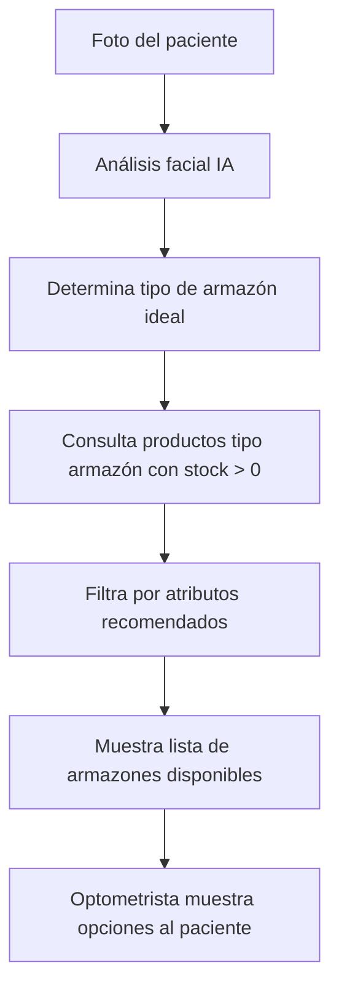

# 🤖 Microservicio de IA - Recomendación de Armazones

## 📖 Introducción
Este microservicio utiliza inteligencia artificial para analizar el rostro del paciente y recomendar armazones que mejor se adapten a sus características faciales. La recomendación es personalizada y solo incluye productos disponibles en el inventario de la óptica.

---

## 🎯 Objetivo
- Sugerir armazones que favorezcan al paciente según su tipo de rostro.
- Mostrar únicamente armazones que estén en stock y disponibles para la venta.
- Facilitar la decisión del paciente y del optometrista con recomendaciones visuales y personalizadas.

---

## 🗂️ Estructura de Productos y Atributos

### **Clasificación de productos**
- Cada producto tiene un campo **tipo** (armazón, lente de contacto, líquido, accesorio, etc.).
- **Solo los productos tipo "armazón"** son considerados para la recomendación de IA.

### **Atributos de armazones**
- Forma (redondo, cuadrado, aviador, etc.)
- Color
- Material (acetato, metal, etc.)
- Tamaño (ancho, alto, puente)
- Género (hombre, mujer, unisex, infantil)
- Marca/modelo
- Foto(s)
- Stock (cantidad disponible)

---

## 🔄 Flujo de Recomendación

1. **El optometrista toma la foto del paciente.**
2. **La IA analiza el rostro** y determina los atributos ideales de armazón (por ejemplo: "rostro redondo, le quedan bien armazones rectangulares").
3. **La IA consulta la base de datos de productos** y filtra:
   - Solo productos tipo armazón
   - Solo con stock > 0
   - Solo los que coinciden con los atributos recomendados (forma, color, etc.)
4. **La IA devuelve una lista de armazones recomendados** (con foto, nombre, marca, precio, etc.).
5. **El optometrista muestra al paciente las opciones** y registra cuál eligió (si aplica).

---

## ⚠️ Consideraciones Importantes
- **Nunca se recomiendan productos agotados.**
- **No se recomiendan productos que no sean armazones** (a menos que se amplíe la lógica en el futuro).
- El inventario debe estar siempre actualizado para que la recomendación sea precisa.
- Si no hay armazones en stock que cumplan los criterios, la IA puede sugerir los más similares disponibles.

---

## 📊 Ejemplo de Consulta de Productos

```sql
SELECT * FROM productos
WHERE tipo = 'armazon' AND stock > 0
AND forma = 'rectangular' AND color = 'negro';
```

---

## 📝 Ventajas de este enfoque
- **Precisión:** Solo se recomiendan productos realmente disponibles.
- **Personalización:** La IA sugiere armazones que favorecen al paciente.
- **Escalabilidad:** Permite manejar cientos o miles de productos.
- **Flexibilidad:** Fácil de ampliar para otros tipos de productos en el futuro.

---

## 🔄 Diagrama del Flujo de Recomendación



---

## 🚦 Recomendaciones para el personal
- Registrar correctamente los productos y sus atributos.
- Mantener actualizado el inventario.
- Usar la herramienta de IA solo para recomendar armazones.
- Comunicar al paciente solo las opciones realmente disponibles.

---

*Este microservicio es una herramienta de apoyo para el optometrista. El paciente nunca interactúa directamente con la IA; todas las recomendaciones son presentadas por el personal de la óptica.* 

graph TD
    A[Foto del paciente] --> B[Análisis facial IA]
    B --> C[Determina tipo de armazón ideal]
    C --> D[Consulta productos tipo armazón con stock > 0]
    D --> E[Filtra por atributos recomendados]
    E --> F[Muestra lista de armazones disponibles]
    F --> G[Optometrista muestra opciones al paciente]